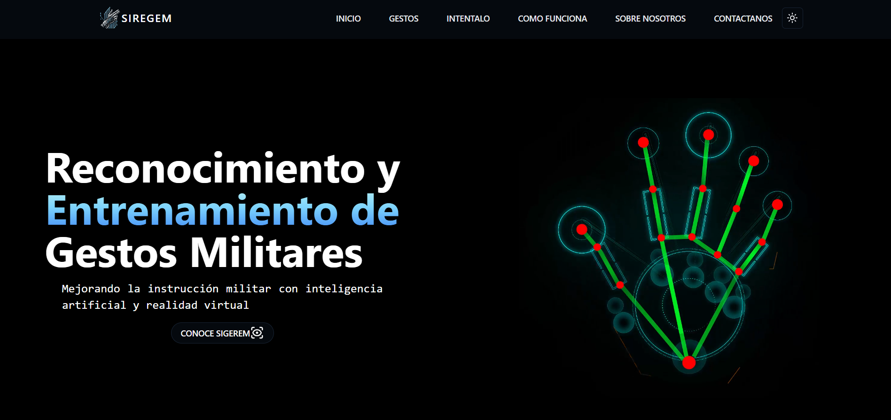
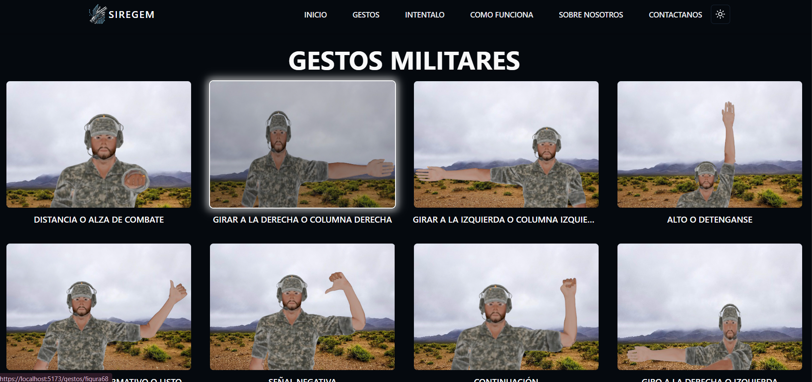

# SIREGEM - Sistema de Reconocimiento de Gestos Militares

    <video src="media/logo.mp4" alt="logo" width="280" autoplay loop muted playsinline>

    
    
    
    
    
    
    
    

## Descripción

SIREGEM es un sistema web de reconocimiento de gestos de lenguaje de señas en tiempo real, diseñado para facilitar la comunicación y el aprendizaje del lenguaje de señas boliviano. El sistema utiliza inteligencia artificial con redes neuronales PyTorch y detección de landmarks mediante MediaPipe para clasificar gestos capturados a través de la cámara web.

Se utilizó React con Vite para el desarrollo del frontend y FastAPI para el backend, implementando comunicación en tiempo real mediante WebSockets. El sistema detecta landmarks faciales y de manos, normaliza las coordenadas relativas a puntos de referencia facial y alimenta estas características a modelos de aprendizaje profundo para predecir el gesto correspondiente.

## Características

- Reconocimiento de gestos en tiempo real mediante cámara web
- Sistema de detección basado en MediaPipe para landmarks faciales y de manos
- Modelos de PyTorch entrenados para clasificar 14 gestos diferentes del lenguaje de señas
- Interfaz web interactiva con galería de gestos y modo de práctica
- Comunicación en tiempo real mediante WebSockets
- API REST con FastAPI para gestión de usuarios y datos
- Normalización de coordenadas para invarianza de escala y posición
- Certificados HTTPS para desarrollo local seguro

## Instrucciones de Uso

### Frontend (React)

1. Abra la terminal y navegue a la carpeta del Frontend: `cd frontend`.
2. Instale las dependencias utilizando el comando: `npm install`.

### Backend (FastAPI)

1. Abra otra terminal y navegue a la carpeta del Backend: `cd backend`.
2. Cree un entorno virtual: `python -m venv venv`.
3. Active el entorno virtual: `venv\Scripts\activate`.
4. Instale las dependencias necesarias ejecutando: `pip install -r requirements.txt`.

## Ejecución

1. En la terminal del Frontend, ejecute el proyecto React con el comando: `npm run dev`.
2. En la terminal del Backend, inicie el servidor FastAPI con: `fastapi dev src/main.py`.

**Nota:** El frontend estará disponible en `https://localhost:5173` y el backend en `https://localhost:8000`. Ambos servidores utilizan HTTPS con certificados SSL locales.

## Gestos Reconocidos

El sistema puede reconocer los siguientes gestos del lenguaje de señas:

| ID | Gesto | ID | Gesto |
|---|---|---|---|
| 1 | figura8 | 8 | figura57 |
| 2 | figura9 | 9 | figura68 |
| 3 | figura19 | 10 | figura69 |
| 4 | figura20 | 11 | figura130 |
| 5 | figura21 | 12 | figura131 |
| 6 | figura34 | 13 | figura166 |
| 7 | figura56 | 100 | no_reconocido |

## Arquitectura del Sistema

### Backend
- **main.py**: Punto de entrada de la aplicación con configuración CORS
- **controllers/**: Controladores para WebSocket, reconocimiento y usuarios
- **services/**: Lógica de negocio (reconocimiento de gestos, procesamiento de imágenes)
- **models/**: Modelos de datos SQLAlchemy/Pydantic
- **modelos/**: Modelos PyTorch entrenados (.pt)

### Frontend
- **App.jsx**: Configuración de rutas con React Router
- **Pages/**: Páginas principales (Home, Gestos, Intentalo, etc.)
- **Components/**: Componentes reutilizables incluyendo CameraRecognition
- **constants/**: Datos estáticos y mapeo de gestos

## Dependencias

Las dependencias están en el mismo repositorio.

## Imágenes

    
    

    
    

## Licencia

Este proyecto está bajo la Licencia MIT. Consulta el archivo [LICENSE](LICENSE) para obtener más detalles.
